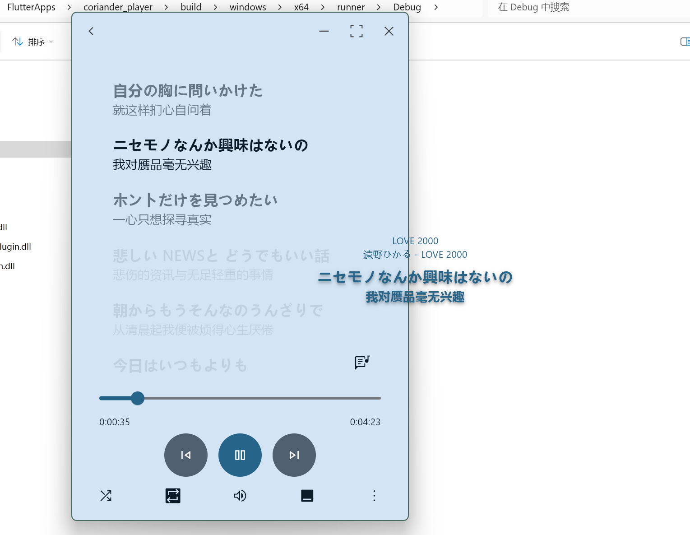

# desktop_lyric: Coriander Player 的桌面歌词组件

- [x] 支持普通歌词
- [x] 自定义歌词样式（字体大小、字体颜色）
- [x] 基本的播放控制（上一曲、暂停/播放、下一曲）
- [x] 主动退出
- [x] 跟随播放器的主题（可选）
- [x] 显示正在播放的曲目的基本信息

自定义字体颜色有三种情况：
1. 如果已经指定颜色，在取消指定颜色前不会跟随播放器主题色变化
2. 在指定颜色的情况下，再次点击被选中的颜色，会取消指定颜色。颜色继续跟随播放器变化。
3. 在指定颜色的情况下，点击其他颜色，指定颜色更改为选择的颜色。在取消指定颜色前不会跟随播放器主题色变化